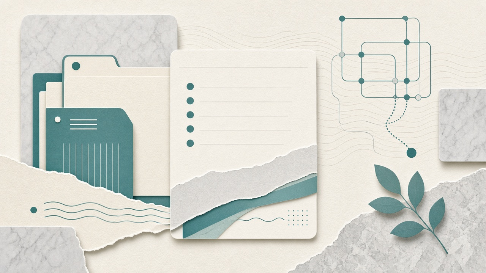

**Module & Mentorship Overview**

Welcome to the Data Science Mentorship!

Congratulations on investing in yourself, I am excited to start this journey with you!

<aside class="ai-clip" data-clip="m0-tour">
  

  

    
Quick overview

    <h3>Mentorship tour</h3>
    
Walkthrough of how DataShip works: shared Google Drive, Slack, sequential modules, worksheets, and how later weeks shift into mocks and offers.

    
~3 min overview

  

</aside>

You will have a shared Google Drive to store related documents throughout the mentorship, where we can collaborate on worksheets and ideas.

Go ahead now and add your resume and cover letter (in PDF or Google Doc format) into the directory called “Resume + Cover”.

Next, you will see a general notes document, please fill in and add links to the fields.

You will be invited to the Slack channel soon. This is the main method of communication throughout the mentorship. Feel free to ask questions in the public channels as well, this is not just a one-person show — we can all network and collaborate!

This is a project-based 1:1 mentorship. Meaning if you are interested in building a project with guidance then it will be included in the mentorship planning and will start in week 2 and be carried out until (ideally) your next position.

The first portion of the mentorship will have a module per week (unless time allocation is less than 20 hours per week). They are in sequential order. There are “BONUS” that are only there for your benefit, they are not required to read/watch.

Some modules have a worksheet(s) included which will be saved into your shared Google Drive.

In the later weeks, the modules will be done and the time will be focused on mock interviews and contract negotiations.

These modules will be converted to videos shortly.

Awesome, let’s get it! 💪
# How we start: assess where you are now, find your gaps, and begin with a coding assessment.

# **Pre-Work:**

- Get [Speechify to read text](https://share.speechify.com/mzrRgpf) then instal**l the **Google Chrome** **extension or** **[Speechify for Chrome](https://chrome.google.com/webstore/detail/speechify-for-chrome/ljflmlehinmoeknoonhibbjpldiijjmm)** t**o listen to the modules while you read them. (I highly suggest)
- Install [Loom – Free Screen and Cam Recorder](https://chrome.google.com/webstore/detail/loom-%E2%80%93-free-screen-and-ca/liecbddmkiiihnedobmlmillhodjkdmb) this will allow us to send and share screen captures instantly and store them in the cloud. (A practical way to communicate!)
- Google Docs tips for the mentorship:
<aside class="ai-clip" data-clip="m0-gdocs">
  

  

    
Quick overview

    <h3>Google Docs tips</h3>
    
How we use the shared Drive during mentorship: offline access, commenting, and keeping worksheets easy for your mentor to review.

    
~1 min overview

  

</aside>
- Module 0 extra material overview:
<aside class="ai-clip" data-clip="m0-extra">
  

  

    
Quick overview

    <h3>Module 0 extra material</h3>
    
What the optional Module 0 extras cover and how to use them without slowing your required checklist.

    
~2 min overview

  

</aside>
