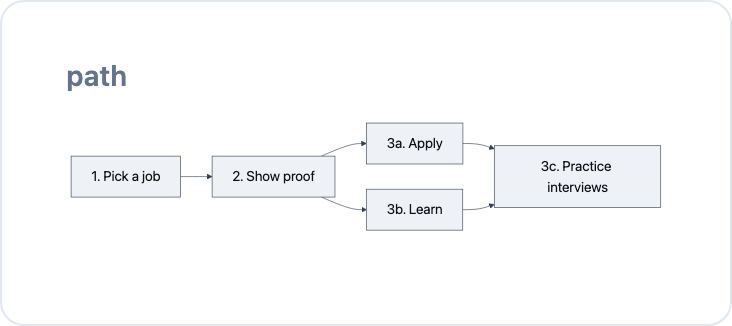
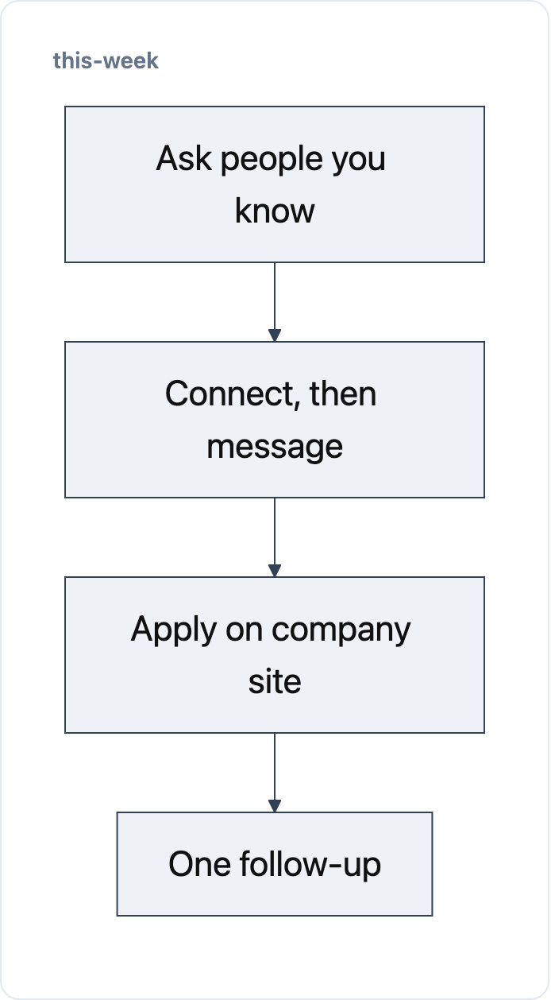
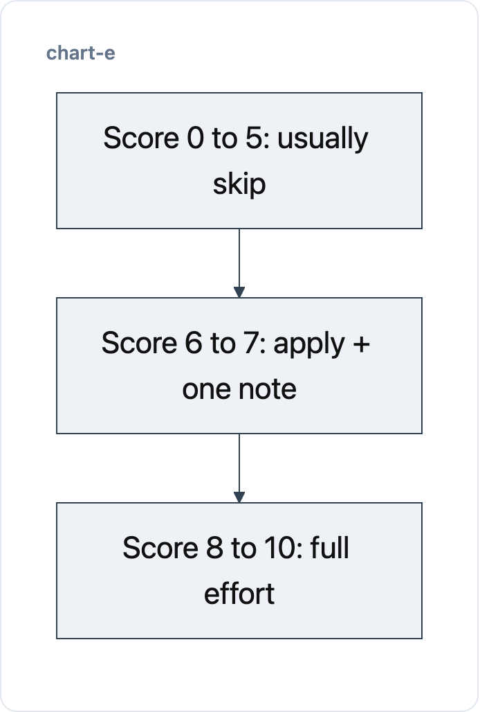
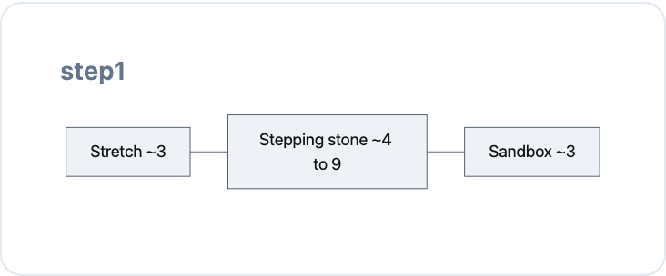
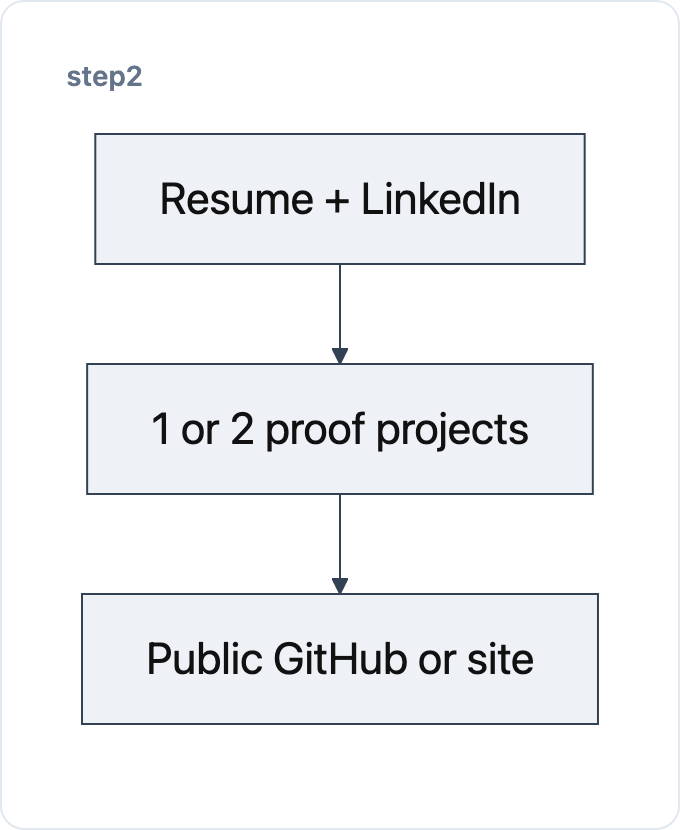
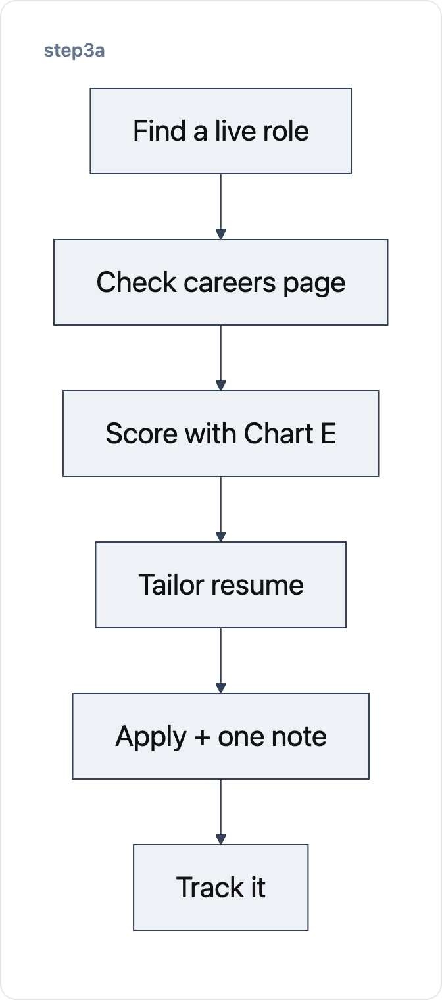
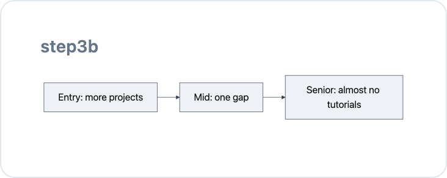
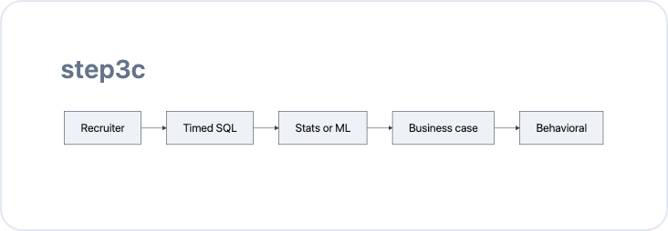
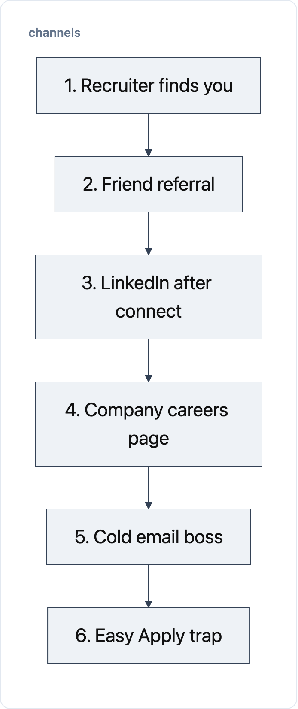

# Job Search Overview v8

You already know enough skills. Now spend your time on **getting seen**—not more certificates.

Numbers below are rough guides (~2025–26). Your path changes by level, city, and market. Do not use only one job board.

### Word bank (plain words)

| Grown-up word | Plain meaning |
|---------------|---------------|
| Referral | A friend at the company asks them to look at you |
| Careers page | The company’s own “jobs” page (not LinkedIn Easy Apply) |
| Hiring manager | The boss for that job |
| Recruiter | Person whose job is to find people |
| Portfolio | Proof you did the work (projects, GitHub, site) |
| Chart E score | A 0–10 grade for “is this job worth my time?” |

---

## Path

### Picture

### In plain words

First pick **one** job title. Then make your resume and projects match that job. Then apply the smart way. Keep learning and practicing interviews **at the same time**.

### Do this

1. Target one role  
2. Match portfolio + resume to that role  
3a. Apply via ranked channels  
3b. Skill-build by seniority (parallel)  
3c. Drill interviews (parallel)

---

## This week

### Picture

### In plain words

Plan about **10 hours** this week. Count real talks and interviews—not how many buttons you clicked. Ask people you know first. Apply on the company website. Follow up **one** time, then wait.

### Do this

1. Warm / referral messages (specific intros)  
2. LinkedIn: connect **without** a note → message after they accept  
3. 4–6 tailored **careers-page** applies (≤48h of posting when possible)  
4. Follow up **once** at **7–10 business days**, then move on  
5. Optional: Wellfound-style pass; contract/agency if that path fits  
6. Cap Easy Apply near zero  

Two-week silence (even after finals) is often normal—not a hard rejection.

### The numbers — hours (~10/wk)

| Block | Hours | Do this |
|-------|------:|---------|
| One-time: recruiter-ready LinkedIn | ~5 | Headline keywords + public proof (once) |
| Warm outreach + follow-ups | ~3/wk | Alumni, coworkers, clients, classmates |
| Tailored direct applies (4–6) | ~2/wk | Careers page; ≤48h when possible |
| Interview drills | ~2/wk | Timed SQL + case framing |
| Skill gap (by level) | 0–4/wk | Chart D under Step 3b |
| Mass Easy Apply / course binge | ~0 | Skip |

**Timeline bands:** senior ~6–12 weeks · mid ~8–16 weeks · entry ~3–9 months (incl. portfolio).

### The numbers — scale-up volume

Count **qualified conversations, screens, interviews, offers**—not raw submissions.

| Time available | Warm / referral | Targeted apps | Direct outreach | Contract / agency | Proof + prep |
|----------------|----------------:|--------------:|----------------:|------------------:|-------------:|
| 5–10 hrs/wk | 3–5 | 4–6 | 3–5 | 1–2 | 1–2 hrs |
| 10–20 hrs/wk | 5–8 | 6–10 | 5–8 | 2–4 | 2–4 hrs |
| Full-time search | 10–15 | 12–18 | 10–15 | 4–6 | 5–8 hrs |

---

## Before you apply — Chart E (effort score 0–10)

### Picture

### In plain words

Before you apply, give the job a grade from **0 to 10**. Five little scores (0, 1, or 2 each) add up. High score = work hard on it. Low score = usually skip.

### Do this

1. Score Interest, Core fit, Proof, Human access, Logistics (each 0–2)  
2. Add them up  
3. Follow the effort table below  
4. Apply when you meet **core** duties and true must-haves (not every bullet)

### The numbers — Chart E

| Factor | 0 | 1 | 2 |
|--------|---|---|---|
| Interest | Would not accept | Acceptable | Strongly want |
| Core fit | Major gaps | Mostly qualified | Direct match |
| Proof | Weak examples | Related evidence | Strong quantified evidence |
| Human access | No contact | Possible contact | Warm contact / referral |
| Logistics | Major conflict | Workable | Remote/part-time/pay fit |

| Total | Effort |
|------:|--------|
| 8–10 | Tailor résumé, seek referral, contact recruiter/manager, attach proof |
| 6–7 | Targeted apply + one concise outreach |
| 0–5 | Usually skip (unless intentional gap-fill) |

Remaining bullets are preferences—not a universal “40% rule.”

Optional quick EV: `interest (1–100) × chance (0–1)` — use alongside Chart E, not instead of it.

---

## Step 1 — Job to target

### Picture

### In plain words

Pick **one** main job title. Write your rules (remote? pay floor?). Make a list of 10–15 companies: some dream, some realistic, some practice.

### Do this

1. Name one primary title (+ optional adjacent stretch)  
2. Set level, remote/hybrid, industry, comp floor  
3. Split must-have vs nice-to-have from real job posts  
4. Build the company list below  

### The numbers — company list (10–15)

| Tier | Count | Meaning |
|------|------:|---------|
| Stretch | ~3 | Dream / harder bar |
| Stepping stone | ~4–9 | Realistic fit |
| Sandbox | ~3 | Practice / easier volume |

**Done when:** title, constraints, and draft company list are named.

---

## Step 2 — Portfolio + resume for that role

### Picture

### In plain words

Your package should match **that** job—not “any data job.” A stranger should “get you” in about six seconds. One project should prove you can do the work.

### Do this

1. Match resume + LinkedIn to the title  
2. Ship 1–2 proof projects that look like that job  
3. Make GitHub and/or a site public  

Deep work: Module 3. This unlocks Chart A ranks 1–2.

**Done when:** a stranger in your target role gets you in ~6 seconds and one artifact proves it.

### The numbers — role-specific proof

| Area | Data scientist | Data analyst |
|------|----------------|--------------|
| Primary evidence | Modeling, experimentation, forecasting, causal/ML systems | SQL, cleaning, KPI design, dashboards, recommendations |
| Case structure | Problem → data → method → validation → production/result → limits | Business question → SQL/analysis → viz → recommendation → effect |
| Best artifacts | Reproducible repo, model card, eval report, deployed demo | SQL notebook, Tableau/Power BI, one-page exec brief |
| Metrics | Lift, calibration, error, latency, revenue/cost | Revenue, conversion, retention, utilization, time/cost saved |

---

## Step 3a — Applying

### Picture

### In plain words

Follow **This week**. For each good job: find it, check the company site, score it, fix your resume top, apply, write one short note, then track it.

### Do this

1. Find a live role (LinkedIn, Indeed, Wellfound, niche board, company alert)  
2. Verify on the **employer careers page** (location, auth, level, pay, tools)  
3. Score with Chart E (6+ continues)  
4. Tailor résumé summary + first bullets to core responsibilities  
5. Apply on the employer site when practical; one short role-specific outreach  
6. Track source, contact, stage, time, outcome  

### Optional board pass (Wellfound-style)

- Low score → 2–3 sentence note  
- High score → ~6 sentences: value first, then why this company  

### The numbers — tracking fields

| Field | Field |
|-------|-------|
| Employer | Role |
| DS/DA subtype | URL |
| Date posted | Date applied |
| Source | Chart E score |
| Résumé version | Contact / referrer |
| Stage | Follow-up date |
| Time spent | Outcome |
| Close reason | |

Review every **20–30** qualified applications (or monthly). Compare screen / interview / offer rates and **outcomes per hour by source**. Double down only where *your* data shows traction. Use Teal or the Module 4 tracker.

---

## Step 3b — Skill-build by seniority (Chart D)

### Picture

### In plain words

Learn while you apply. New people need more projects. Mid people fix one gap. Senior people stop tutorial loops and talk to people.

### Do this

1. Find your row in Chart D  
2. Cap skill hours to that row  
3. Keep applying in parallel  

### The numbers — Chart D

| Level | Skill hours | Rule |
|-------|-------------|------|
| Entry (0–2 yrs) | Higher | 3–4 end-to-end portfolio projects (messy data → ship → README with problem + metric). Certificates alone don’t fix experience. |
| Mid (2–5 yrs) | One gap max | SQL/Python assumed. One differentiator (LLM/RAG, experiments, MLOps awareness). |
| Senior (5+ yrs) | Near zero | Distribution + interviews. No tutorial loops. |

---

## Step 3c — Interview bottleneck

### Picture

### In plain words

Interviews are often **4–6** rounds. Timed SQL and business cases knock people out more than vocabulary quizzes. Practice with a clock.

### Do this

1. ~2 hours live SQL under a clock each week  
2. One case told as a business decision  
3. Details in Module 5  

Loops often run: recruiter → timed SQL → stats/ML judgment → business case → behavioral.

---

## Channel reference

### Picture — Chart A ladder (best hours at the top)

### In plain words

Some doors waste your time. Friends and recruiters who find you are best. Easy Apply is the trap. Chart A says where **hours** pay off. Chart B says where **hires** come from. Use both: mix warm + company site + recruiter notes.

### Do this

1. Spend most hours on ranks 1–4  
2. Cap cold email (rank 5) at 5–10/week  
3. Near-zero Easy Apply (rank 6)  

### The numbers — Chart A (offers per hour)

| Rank | Channel | Signal rate | Per-hour verdict |
|-----:|---------|-------------|------------------|
| 1 | Recruiter inbound (strong LinkedIn) | ~25–40% interview | Setup once; then free leads |
| 2 | Warm / referral | ~15–20% to interview; ~7x boards on hire | Best leverage |
| 3 | LinkedIn message **after** connect | ~10% reply | Beats cold email ~2:1; no address hunt |
| 4 | Tailored company site (≤48h of posting) | ~5–8% interview | Selective; ~15–30 min each |
| 5 | Personalized hiring-manager cold email | ~5–15% reply if deep | Cap **5–10/week**; never primary |
| 6 | Easy Apply / mega-boards | ~2–4% interview | Volume trap — ~0 hours |

**LinkedIn rule:** connection requests **without** a note. Connect first → message second (~10% reply after accept vs ~3% with a note on the request).

**Recruiter rule:**

- **Inbound:** optimize to be found; reply fast  
- **Outbound:** email hiring manager / data lead—not mass Talent/HR spam. Optional: one short note to the **named posting recruiter** when the requisition is public  

Biggest mistake: spending most hours on rank 6.

### The numbers — operating mix (feeds This week)

Efficiency rank ≠ weekly checklist. Run this **mixed** order:

| Priority | Channel | DS | DA | What to do |
|---------:|---------|:--:|:--:|------------|
| 1 | Warm contacts / referrals | 10 | 10 | Ask for a **specific** intro (colleagues, clients, managers, alumni, same-function employees) |
| 2 | Employer careers page | 9 | 9 | Live high-fit opening; tailor résumé top third + employer terms |
| 3 | Recruiter + hiring-manager outreach | 9 | 8 | Inbound reply + HM/data-lead note; named posting recruiter OK |
| 4 | Contract / fractional / staffing | 9 | 8.5 | Optional path—esp. DA / career switchers (C2H, project, consulting) |
| 5 | LinkedIn, Wellfound, Indeed, niche boards | 7 | 7.5 | **Discovery + selective coverage**—not mass apply |

### The numbers — Chart B (where hires come from)

Share of **eventual hires** by source (directional):

| Source | Data scientist | Data analyst | Examples |
|--------|---------------:|-------------:|----------|
| Cold — job boards | 22% | 27% | LinkedIn Apply, Indeed, Built In |
| Cold — company careers page | 28% | 29% | Employer site |
| Referral / warm intro | 19% | 18% | Employee submit, ex-colleague |
| Recruiter finds you | 21% | 18% | InMail, agency / ATS |
| Internal / agency / campus / other | 10% | 8% | Transfer, C2H, internship |

Boards + career pages create **volume**. Warm + recruiter create **efficiency**. Weight the mix to priorities 1–3.

**Chart A vs Chart B:** boards win volume because everyone uses them; referrals win **per applicant** (~6–7% of applicants).

---

## Templates

### Referral request

Hi [Name]—I’m applying for [role/requisition] at [company]. My work in [relevant area] aligns closely, especially [one quantified result]. If you’re comfortable, would you refer me or point me to the right person? I can send a short forwardable summary and résumé.

### Recruiter or hiring manager

Subject: [Role] — [specific fit]

Hi [Name]—I applied for [role/requisition]. I have [years/type] in [two capabilities], including [one result]. Concise example: [portfolio link]. If the team is still hiring, I’d welcome a brief conversation.

### Wellfound / startup

Hi [Name]—I’m interested in [role] because [specific company/problem reason]. I’ve built [related system/analysis] and achieved [result]. That could help your team [outcome]. Portfolio: [link].

---

## Appendix — Cold email (secondary only)

Max **5–10/week**, high-fit + personalized only. Never primary (Chart A rank 5).

1. High-score company hiring  
2. Hiring manager / data lead (not HR/Talent mass-blast)  
3. Verified email  
4. Value-first note  
5. Send **Tue–Thu, 8–10 AM** their time  
6. Pair LinkedIn message on highest-EV targets  

**Contact:** ≤100 → Founder/CEO/CTO/VP Eng · larger → Director/VP of Data  

Generic blasts (~1–5% reply)—skip.

---

## Tools and guardrails

- AI: extract requirements, compare evidence, draft variants, prep interviews—**verify every claim**  
- Grammarly (or similar): final check, not your voice  
- Progress: **[Live app with login](https://elliotastern.github.io/mentoring-progress/)** · Doc template: **[02 - Job Search Progress Checklist](02%20-%20Job%20Search%20Progress%20Checklist.md)**  
- Tracker: Teal or Module 4 worksheet (per-job rows)  

**Do not repeat:** “ATS rejects 75% of résumés,” “all recruiters are the wrong contact,” or “meeting 40% of requirements is always enough.”  

Prefer public business channels over private addresses. Avoid duplicate agency submissions.

Questions: Slack **#4-applying-and-networking**

---

## Sources

Inbound still produces many hires; referrals and direct sourcing are disproportionately efficient → **mixed strategy** (targeted inbound + warm + employer-initiated paths).

- Ashby, [How many hires really come from inbound?](https://www.ashbyhq.com/talent-trends-report/reports/inbound) (2025)  
- Ashby, [Are referred candidates more likely to get hired?](https://www.ashbyhq.com/talent-trends-report/reports/referrals) (2025)  
- Gem, [Hiring AI & engineering talent in 2026](https://www.gem.com/resource/tech-hiring-guide)  
- Also: [Perplexity notes](https://www.perplexity.ai/search/0cc41cbe-cb1d-41a9-9912-77adb63fc877) and public outreach benchmarks  

Planning aids only. Prior drafts: `archive/4-Search/` (v2–v7).
