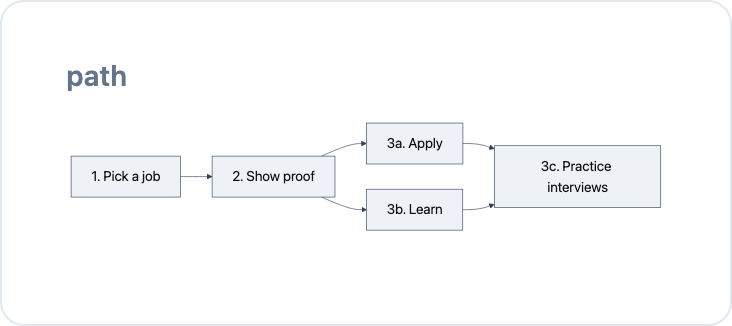
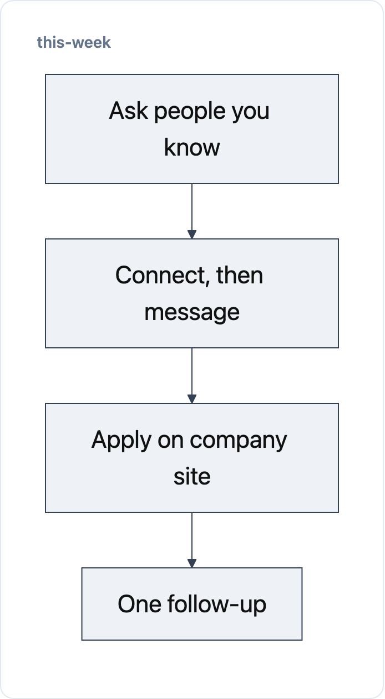
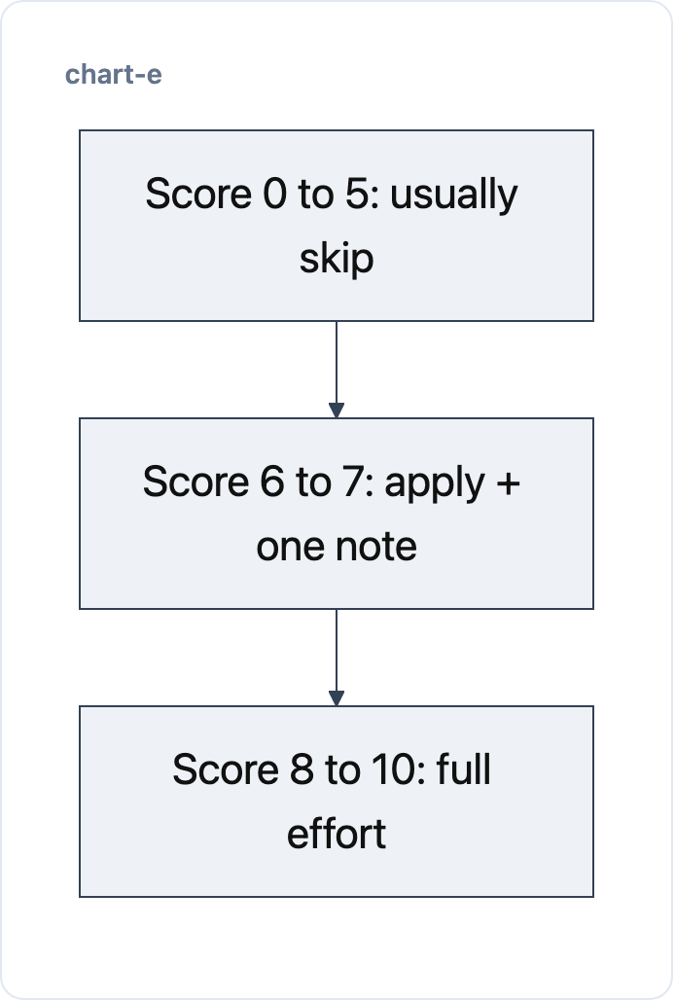
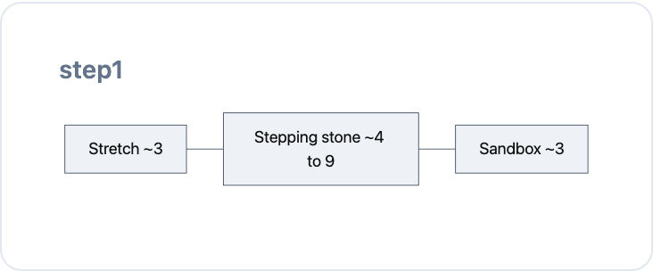
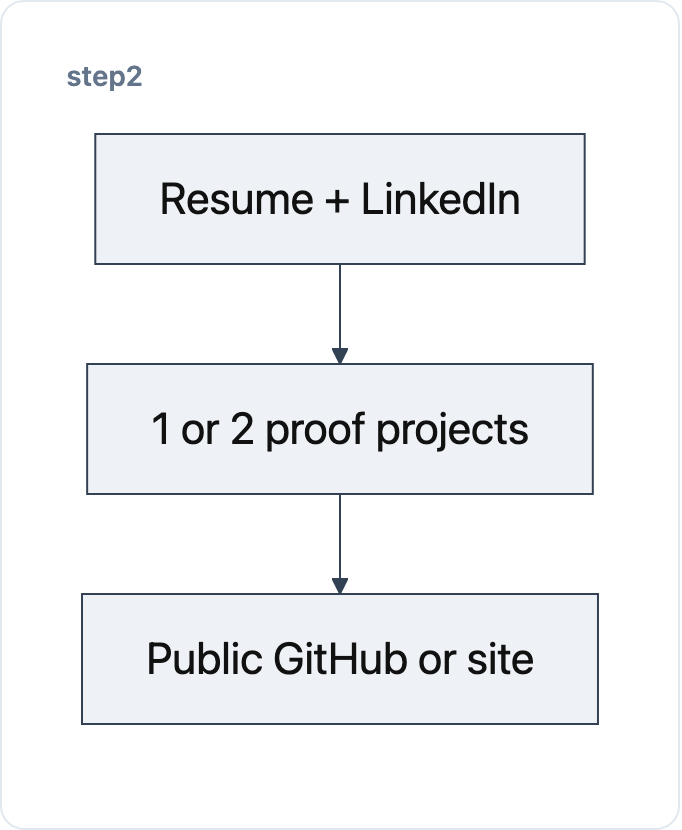
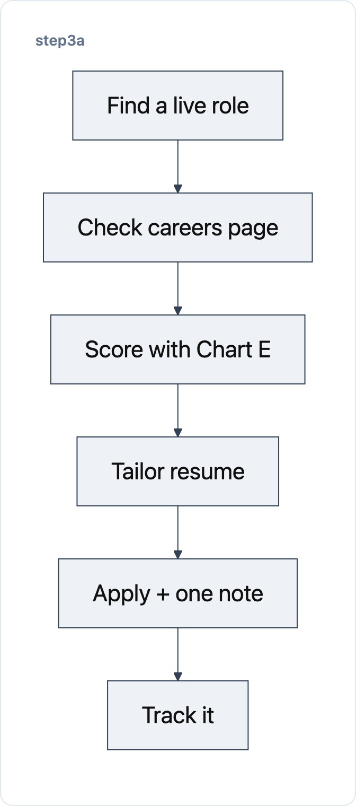
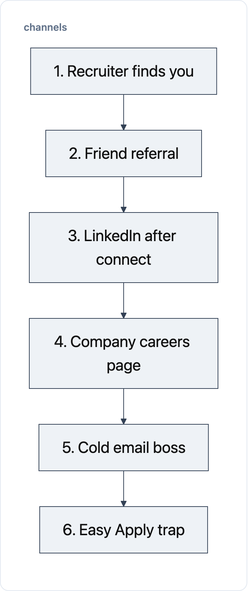

# Job Search Overview v8

You already know enough skills. Now spend your time on **getting seen**, not on more certificates.

Numbers below are rough guides (~2025-26). Your path changes by level, city, and market. Do not use only one job board.

### Word bank (plain words)

| Grown-up word | Plain meaning |
|---------------|---------------|
| Referral | A friend at the company asks them to look at you |
| Careers page | The company's own "jobs" page (not LinkedIn Easy Apply) |
| Hiring manager | The boss for that job |
| Recruiter | Person whose job is to find people |
| Portfolio | Proof you did the work (projects, GitHub, site) |
| Channel payoff ranks | Which apply channels repay your time best |
| Hire sources | Where hires actually come from |
| Job effort score | A 0-10 grade for "is this job worth my time?" |

---

## Path

### Picture

### In plain words

First pick **one** job title. Then make your resume and projects match that job. Then apply the smart way.

### Do this

1. Target one role  
2. Match portfolio + resume to that role  
3. Apply via ranked channels  

---

<h2 id="this-week">This week</h2>

### Picture

### In plain words

Plan about **10 hours** this week. Count real talks and interviews, not how many buttons you clicked. Warm intros and a tight portfolio pay best. Mass Easy Apply is usually the trap.

**Plan hours and channels in the [Weekly Application Dashboard](https://elliotastern.github.io/mentoring-progress/?ws=job-optimizer).** It orders Channel payoff ranks, subtracts what you already tried, and shows what to do with the hours left. Follow up **one** time at 7-10 business days, then wait.

Two-week silence (even after finals) is often normal, not a hard rejection.

**Timeline bands:** senior ~6-12 weeks · mid ~8-16 weeks · entry ~3-9 months (incl. portfolio).

---

<h2 id="before-you-apply-chart-e-effort-score-0-10">Before you apply: Job effort score (0-10)</h2>

### Picture

### In plain words

Before you pour time into a posting, give it a **0-10 Job effort score**. High score = work hard on it. Under **6** = usually skip (unless you are practicing). Apply when you meet **core** duties and true must-haves, not every bullet.

**Score each live posting in [Company Fit](https://elliotastern.github.io/mentoring-progress/?ws=company-fit)** (Interest, Core fit, Proof, Human access, Logistics). The sheet totals the score and shows the effort band.

Remaining bullets are preferences, not a universal "40% rule."

---

<h2 id="step-1-job-to-target">Job to target (Setup path)</h2>

### Picture

### In plain words

Pick **one** main job title. Write your rules (remote? pay floor?). Make a list of 10-15 companies: some dream, some realistic, some practice.

### Do this

1. Name one primary title (+ optional adjacent stretch) in **Job Target** (top of Progress) and [Brainstorm](https://elliotastern.github.io/mentoring-progress/?ws=brainstorm)  
2. Set level, remote/hybrid, industry, and compensation floor in Job Target  
3. Split must-have vs nice-to-have from real job posts  
4. Build Stretch · Stepping · Sandbox in [Company Fit](https://elliotastern.github.io/mentoring-progress/?ws=company-fit) (write surface for the company list)  

Rough mix: ~3 Stretch, ~4-9 Stepping stone, ~3 Sandbox.

**Done when:** title, Job Target constraints, and draft company list are named.

Optional deep read: [Target Companies Guide](target-companies.md).

---

<h2 id="step-2-portfolio-resume-for-that-role">Portfolio + resume for that role (Setup path)</h2>

### Picture

### In plain words

Your package should match **that** job, not "any data job." A stranger should "get you" in about six seconds. One project should prove you can do the work.

### Do this

1. Match resume + LinkedIn to the title  
2. Ship 1-2 proof projects that look like that job  
3. Make GitHub and/or a site public  

Deep work: Module 3. This unlocks Channel payoff ranks 1-3 (warm leverage, Wellfound notes, inbound from portfolio).

**Done when:** LinkedIn, resume, GitHub, and personal site are **submitted in the Progress app** (each piece gets a saved date; [Awesome Screenshot](https://www.awesomescreenshot.com/) speeds capture into a Doc link), and a stranger in your target role gets you in ~6 seconds.

### The numbers: role-specific proof

| Area | Data scientist | Data analyst |
|------|----------------|--------------|
| Primary evidence | Modeling, experimentation, forecasting, causal/ML systems | SQL, cleaning, key metric design, dashboards, recommendations |
| Case structure | Problem → data → method → validation → production/result → limits | Business question → SQL/analysis → viz → recommendation → effect |
| Best artifacts | Reproducible repo, model card, eval report, deployed demo | SQL notebook, Tableau/Power BI, one-page exec brief |
| Metrics | Lift, calibration, error, latency, revenue/cost | Revenue, conversion, retention, utilization, time/cost saved |

Deeper walkthrough: [Portfolio Package Guide](portfolio-package.md).

---

<h2 id="apply-loop">Apply loop</h2>

### Picture

### In plain words

Follow **This week** in the Weekly Application Dashboard. For each good job: find it, check the company site, score it, fix your resume top, apply, write one short note, then track it.

### Do this

1. Find a live role (warm / referral first when you can, then Wellfound, then boards)  
2. Verify on the **employer careers page**  
3. Score with Job effort score in [Company Fit](https://elliotastern.github.io/mentoring-progress/?ws=company-fit) (continue at **6+** unless practicing)  
4. Tailor résumé summary + first bullets; apply on the employer site; one short note (copy in [Networking scripts](https://elliotastern.github.io/mentoring-progress/?ws=networking-scripts))  
5. Log the row in [Tracker setup](https://elliotastern.github.io/mentoring-progress/?ws=tracker-setup) (or Teal with the same columns)  

<h3 id="wellfound-pass-chart-a-rank-2">Wellfound pass (Channel payoff rank 2)</h3>

Treat Wellfound as your **high-capacity discovery + note** loop for startup / high-fit roles (after warm intros for the day).

- Low Job effort score → 2-3 sentence note  
- High Job effort score → ~6 sentences: value first, then why this company  
- Still verify on the employer careers page before you invest a full tailor  

Use the Wellfound template in [Networking scripts](https://elliotastern.github.io/mentoring-progress/?ws=networking-scripts).

<h3 id="the-numbers-tracking-fields">The numbers: tracking fields</h3>

Set columns once in [Tracker setup](https://elliotastern.github.io/mentoring-progress/?ws=tracker-setup): employer, role, source, Job effort score, stage, follow-up, time, outcome, and the rest of the checklist there.

Review every **20-30** qualified applications (or monthly). Compare screen / interview / offer rates and **outcomes per hour by source**. Double down only where *your* data shows traction.

---

## Channel reference

### Picture: Channel payoff ranks (best hours at the top)

### In plain words

Some doors waste your time. Warm intros and a tight portfolio pay best. Mass Easy Apply is usually the trap. **Channel payoff ranks** order channels by payoff on the time you spend. **Hire sources** show where hires actually come from (boards win volume; warm + recruiter win efficiency).

**Allocate the week in the [Weekly Application Dashboard](https://elliotastern.github.io/mentoring-progress/?ws=job-optimizer).** It is the source of truth for ranks, times, capacity, and what is left after attempts.

### Do this

1. Spend most hours on ranks 1-4 (warm, Wellfound, portfolio, careers page + human contact)  
2. Agency, LinkedIn, and hiring-manager outreach after 1-4 are capped for the week  
3. Selective board applies after that; mass Easy Apply only with an explicit opt-in, never as the default  

<h3 id="the-numbers-chart-a-practical-payoff">The numbers: Channel payoff ranks</h3>

Open the [Weekly Application Dashboard](https://elliotastern.github.io/mentoring-progress/?ws=job-optimizer) for the live rank list, midpoints, and remaining plan. Offline twin: [ws-job-optimizer.md](ws-job-optimizer.md).

**LinkedIn rule:** connection requests **without** a note. Connect first → message second.

**Recruiter rule:**

- **Inbound:** optimize to be found; reply fast  
- **Outbound:** email hiring manager / data lead, not mass Talent/HR spam. Optional: one short note to the **named posting recruiter** when the requisition is public  

**Mass Easy Apply (rank 9, opt-in only):** For about 90% of candidates this is not the best strategy. It can work for niche / early / top-fit cases within ~24 hours. Default allocation stays near zero.

Biggest mistake: spending most hours on ranks 8-9 without those conditions.

<h3 id="the-numbers-chart-b-where-hires-come-from">The numbers: Hire sources</h3>

Share of **eventual hires** by source (directional): boards + careers pages create **volume**; warm + recruiter create **efficiency**. Weight the mix toward warm, Wellfound, portfolio, and careers-page + human contact first.

| Source | Data scientist | Data analyst | Examples |
|--------|---------------:|-------------:|----------|
| Cold - job boards | 22% | 27% | LinkedIn Apply, Indeed, Built In |
| Cold - company careers page | 28% | 29% | Employer site |
| Referral / warm intro | 19% | 18% | Employee submit, ex-colleague |
| Recruiter finds you | 21% | 18% | InMail, agency / applicant tracking system |
| Internal / agency / campus / other | 10% | 8% | Transfer, contract-to-hire, internship |

---

## Templates

Paste and tweak in [Networking scripts](https://elliotastern.github.io/mentoring-progress/?ws=networking-scripts). Starters:

### Referral request

Hi [Name] - I'm applying for [role/requisition] at [company]. My work in [relevant area] aligns closely, especially [one quantified result]. If you're comfortable, would you refer me or point me to the right person? I can send a short forwardable summary and résumé.

### Recruiter or hiring manager

Subject: [Role] - [specific fit]

Hi [Name] - I applied for [role/requisition]. I have [years/type] in [two capabilities], including [one result]. Concise example: [portfolio link]. If the team is still hiring, I'd welcome a brief conversation.

### Wellfound / startup

Hi [Name] - I'm interested in [role] because [specific company/problem reason]. I've built [related system/analysis] and achieved [result]. That could help your team [outcome]. Portfolio: [link].

---

## Appendix - Cold email (secondary only)

Max **5-10/week**, high-fit + personalized only. Never primary (below Channel payoff ranks 1-4).

1. High-score company hiring  
2. Hiring manager / data lead (not HR/Talent mass-blast)  
3. Verified email  
4. Value-first note  
5. Send **Tue-Thu, 8-10 AM** their time  
6. Pair LinkedIn message on highest expected-value targets  

**Contact:** ≤100 → Founder/CEO/CTO/VP Eng · larger → Director/VP of Data  

Generic blasts (~1-5% reply): skip.

---

## Tools and guardrails

- AI: extract requirements, compare evidence, draft variants, prep interviews. **Verify every claim**  
- Grammarly (or similar): final check, not your voice  
- Progress: **[Live app with login](https://elliotastern.github.io/mentoring-progress/)** · Doc template: **[02 - Job Search Progress Checklist](02%20-%20Job%20Search%20Progress%20Checklist.md)**  
- Tracker: Teal or [Tracker setup](https://elliotastern.github.io/mentoring-progress/?ws=tracker-setup)  
- Week plan: [Weekly Application Dashboard](https://elliotastern.github.io/mentoring-progress/?ws=job-optimizer)  
- Job effort + company tiers: [Company Fit](https://elliotastern.github.io/mentoring-progress/?ws=company-fit)  

**Do not repeat:** "Applicant tracking systems reject 75% of résumés," "all recruiters are the wrong contact," or "meeting 40% of requirements is always enough."  

Prefer public business channels over private addresses. Avoid duplicate agency submissions.

---

## Sources

Inbound still produces many hires; referrals and direct sourcing are disproportionately efficient: **mixed strategy** (targeted inbound + warm + employer-initiated paths).

- Ashby, [How many hires really come from inbound?](https://www.ashbyhq.com/talent-trends-report/reports/inbound) (2025)  
- Ashby, [Are referred candidates more likely to get hired?](https://www.ashbyhq.com/talent-trends-report/reports/referrals) (2025)  
- Gem, [Hiring AI & engineering talent in 2026](https://www.gem.com/resource/tech-hiring-guide)  
- Also: [Perplexity notes](https://www.perplexity.ai/search/0cc41cbe-cb1d-41a9-9912-77adb63fc877) and public outreach benchmarks  

Planning aids only. Prior drafts: `archive/4-Search/` (v2-v7).
